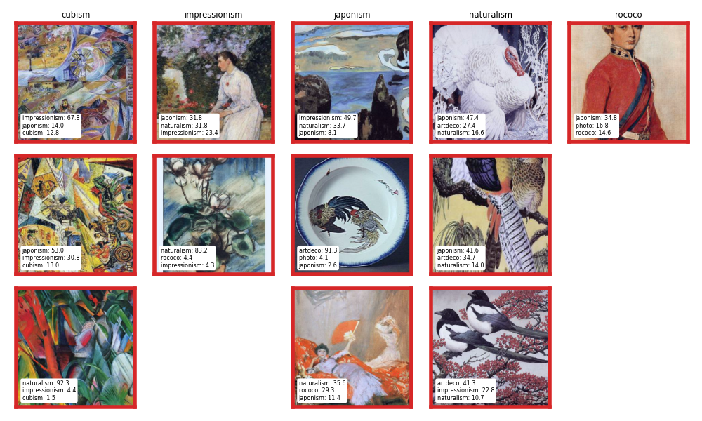

> Note
> 
> This README is a translated version of the original README in russian, available [here](./README-russian-original.md).

# Project Description
The goal of this project is to develop a model capable of differentiating paintings based on their artistic style. The project explores various approaches to achieve this goal, including the implementation of neural network models and hybrid architectures combining neural networks with random forest classifiers. Additionally, the project aims to leverage metric learning techniques to enhance the model's performance and incorporates Explainable AI (Artificial Intelligence) techniques to provide insights into the model's decision-making process.

## 0. Experiment Design

[`src/create_annotation.py`](src/create_annotation.py)

[`src/create_design.py`](src/create_design.py)

I have around 1400 images in 8 styles. Some style names include author names (there are no authors for photos and cartoons). I decided to split the dataset into parts as follows:
- 5% for validation set
- Remaining 95% = 4 folds for cross-validation (CV)

I ensured that all (4 + 1) = 5 folds do not share common authors. This is to reduce overfitting/data leakage. The style of one author may be memorable, so a classifier trained on images from this author may likely recognize other images by them in the test set. By splitting based on authors, I aimed to include approximately the same number of authors and roughly the same number of images in all folds.

Unlike the 4 CV folds, the validation dataset is additionally complicated – I included as many authors in it as possible. Thus, it contains many authors with only one image each. Here's the table with the number of authors and images in each fold:

```
              author                 filename                
fold_author        0   1   2   3 val        0   1   2   3 val
label                                                        
artdeco            2   2   2   2   3       10  31  10  11   3
cartoon            1   1   1   1   1       18  18  18  17   4
cubism            17  17  17  16  18       81  89  85  92  18
impressionism     23  23  23  22  11       58  50  61  60  11
japonism           6   6   5   5   7       55  42  57  40   9
naturalism         2   2   2   2   3       45  83  61  20   9
photo              1   1   1   1   1       33  33  33  33   7
rococo             5   5   4   4   5       20  21  47  24   5
```

I chose top 2 accuracy as the quality metric for all classification tasks, weighted by classes. (I also logged many other metrics but did not rely on them for model selection, see [`src/scorers/ScorerCombo.py`](src/scorers/ScorerCombo.py)). Top 2 accuracy seems more appropriate to me than regular accuracy (top 1) or F1 score because the classes are not mutually exclusive, and I don't want to discard a model just because it found a couple of plausible classes instead of one. For example, an image might depict animals in bright colors with broad strokes, which could be partially naturalism and impressionism. Moreover, artistic styles didn't emerge suddenly in history; each artist has influences from their "neighbors." However, some classes do significantly differ from all others, such as photos. I don't consider top 3 accuracy because 3 is nearly half of my 8 classes.

## 1. Image Classification by Style Using Neural Network.

### Architecture


[`src/models/models.py`](src/models/models.py)

I've constructed a neural network as depicted in the image above.
1. A pretrained ResNet generates features, passing a 1000-dimensional vector through ReLU into a fully connected layer. The output of this layer is termed an "embedding," and the entire construct that creates it is called an Embedder.
2. The embedding then passes through another ReLU into the final fully connected layer, which outputs logits for 8 classes.

I've used CrossEntropyLoss as the error function for my task.

The images in the training set underwent the following transformations:
```python
transform_resnet = resnet_weights.DEFAULT.transforms()
transform_train = transforms.Compose(
    [
        transforms.RandomRotation(45),
        transforms.RandomHorizontalFlip(p=0.5),
        transforms.ColorJitter(
            brightness=0.25, contrast=0.25, saturation=0.25, hue=0.0
        ),
        transforms.RandomErasing(p=0.5),
        transform_resnet,
    ]
)
```

Only `transform_resnet` was used in the testing phase.

### Hyperparameter Optimization

[`src/optunize_nn_classifier.py`](src/optunize_nn_classifier.py)

The hyperparameters I tuned during training are fixed in [params.yaml](params.yaml), under the section `optunize_nn_classifier`. The main ones include:
- ResNet depth. In my CV experiments, the quality tended to increase with deeper ResNets. However, the improvement was marginal. For example, the median top 2 accuracy over 4 folds was `0.76` and `0.81` for ResNet18 and ResNet50, respectively. Training with very deep models is time-consuming (I ran everything on an Apple M1 Pro), so for all further experiments, I stuck with ResNet18.
- I also found from CV that it's beneficial to unfreeze the entire ResNet and train it along with the added layers.
- Learning rate. Since the ResNet parameters are initially close to optimal, I started with a small learning rate and exponentially decreased it to `1e-5` by the end of training.
- Embedding size. The curse of dimensionality here plays into our hands because it's easier to spread out classes in a higher-dimensional space. However, it's also easier to overfit in high-dimensional spaces.

Additionally, I prepared label smoothing and weight decay for tuning, but I didn't touch them, although they could have improved model generalization. Also, it would have been beneficial to implement two optimizers working simultaneously – one optimizing the CNN (feature generator) and the other optimizing the linear layers. The former should take small steps while the latter takes larger ones.

Based on the results of cross-validation, I chose the following parameters:
```yaml
mlflow_run_id: ca8ff65afb5744a2bde060f116d70a22
resnet_name: resnet18
embedding_size: 16
lr_start: 0.0001
```

Using these parameters, I trained the final model, selecting a split between train and test (from the 4 already prepared folds) that yielded the best performance. This point is debatable because the test set may have turned out to be too easy in this case.

### Results of Training the Best Model


Confusion matrix, test dataset. Normalized by rows (recall on the main diagonal).


Classification report, test dataset.
```
               precision    recall  f1-score   support

      artdeco       0.30      0.70      0.42        10
      cartoon       0.92      0.67      0.77        18
       cubism       0.91      0.80      0.85        85
impressionism       0.83      0.70      0.76        61
     japonism       0.65      0.81      0.72        57
   naturalism       0.71      0.64      0.67        61
        photo       0.88      0.91      0.90        33
       rococo       0.83      0.87      0.85        46

     accuracy                           0.77       371
    macro avg       0.75      0.76      0.74       371
 weighted avg       0.79      0.77      0.78       371
```

#### artdeco
There are issues with precision for artdeco. If this is critical for the production model, it's necessary to train a separate model, a binary classifier for artdeco vs all. For this task, it's worth rebuilding the dataset (thinning out the other classes) since artdeco is much less represented. A more suitable error function can be chosen, for example, FocalLoss.

#### naturalism
Better than artdeco, but still poor. Naturalism is adequately represented in the dataset. The problem with it lies elsewhere. This class is more of an "attribute" or "label" (multi-label task) rather than a distinct class.

#### photo
This is the champion: f1_score = 0.9. Everything is clear here; the photo class is not a painting style.

### Validation
At the very end, I extract the validation dataset and evaluate the final quality – top 2 accuracy = 0.8.
For the baseline, random guessing can be considered, which yields 0.25.

```
       precision  recall  fscore  top_1_accuracy  top_2_accuracy
name                                                            
train       0.96    0.96    0.96            0.97            0.99
test        0.79    0.77    0.77            0.76            0.91
val         0.63    0.62    0.61            0.63         -> 0.80
```

### Examples

The following grids of images should be read as follows:
Columns represent the true class.
Rows show randomly selected examples.
In the white rectangle are the top-3 predicted classes and their probabilities in percentages.

#### Top-1


#### Top-2


I'll explain some examples since top 2 accuracy is precisely my target metric.
The indexing is as follows: (style, row number).

(naturalism, 3), top 1 -- rococo.
This is plausible because it depicts a person in "earthy" tones.

(impressionism, 2), top 1 -- naturalism.
Depicts nature.

(impressionism, 3), top 1 -- cubism.
A clear example of similar styles.

(photo, 1) and (photo, 2), top 1 -- naturalism.
Dogs in nature.

(photo, 3), art deco dog.
Likely due to overexposure and a pale color palette.

(rococo, 2), top 1 -- art deco.
Black and white color palette, not characteristic of rococo paintings.

(cartoon, 2), top 1 -- japonism.
One could argue that the neural network is correct here because of the dark outlines and smooth gradient fill.

(cartoon, 3), top 1 -- japonism.
No explanations, an error. XAI should be applied.

And so on...

#### Occlusion maps for top-2

I wanted to use [Captum](https://captum.ai/tutorials/Resnet_TorchVision_Interpret), but it didn't work for me.
So I implemented the simplest method myself – occlusion.
In the caption, I left only the top-1 and top-2 classes with their probabilities.
The last row – occlusion amplitude – shows how much the probability of the true class changes (absolute value) when certain parts of the image are occluded.
Colors signify the following:
Blue – if the square is removed (part of the image is zeroed out), the probability of the true class decreases.
Red – on the contrary, this square "hinders" the determination of the true class.


(japonism, 1) – predicted as rococo.
Firstly, I personally don't think it's japonism.
Secondly, I agree that the red squares contain rococo-like faces.

(photo, 1) and (photo, 2) – predicted as naturalism.
To increase the probability of the true class photo, you need to remove the dogs.

(photo, 3) – predicted as art deco.
Here, it seems like nothing can be done.
This is a real overexposed art deco dog.

I'm currently unable to provide interpretations for the rest of the examples.

#### Paintings with Predicted Classes Not in Top-2



Interestingly, the third class in all these images is indeed the predicted one.

## 2. Clustering of Embeddings (Outputs of the Penultimate Layer)

The image shows the "evolution" of embeddings.
The model achieved its best performance at epoch 9.
The embeddings are 16-dimensional, but for visualization in 2D, I used UMap.


Clustering using both kNN and AgglomerativeClustering resulted in the maximum silhouette score when the number of clusters was equal to the number of classes (8). The next image is obtained from the data of the best epoch:


Japonism, cartoon, and photo are in their own distant clusters (art deco barely connects with cubism).
It's understandable for cartoon and photo – they're not paintings.
Japonism is separated, probably because it's not a European painting style.
The other classes are arranged more interestingly.
I see a path from rococo through naturalism, impressionism, and cubism to art deco.
I'm not sure about naturalism (it slightly overlaps with impressionism), but the rest of the classes are arranged in chronological order (if compared with Wikipedia).

*Note: During experiments, I also noticed that increasing the learning rate by an order of magnitude prevents such beautiful clustering, although the classification task is solved similarly well.*

## 3. Metric Learning

[`src/train_embedder.py`](src/train_embedder.py)

Metric learning is well-suited for open-set tasks. In my case, the final goal is to classify already established, fixed classes (closed-set). However, it's possible to try building embeddings using metric learning on all classes except, let's say, a pair of classes. After training, embed the withheld classes and evaluate the result. I withheld the classes photo and naturalism.

From my experience, loss functions that work with angles through CosineSimilarity perform best when building embeddings. I chose ArcFaceLoss, but even with that, the task was solved poorly. As a metric, I used silhouette score (as in the previous section on clustering) because it's simple and quick to implement.

Since ArcFaceLoss works with embeddings on the hypersphere, I decided to make the embedder in 3D to create interesting visuals. I also experimented with embeddings in higher-dimensional space, but the quality didn't change.

Native space: [click](images/arccos-native-60721c74bc834d52a53f486ff813d08c.html).

Normalized embedding vectors (lying on the unit sphere): [click](images/arccos-sphere-60721c74bc834d52a53f486ff813d08c.html).

The withheld classes are spread across the entire surface of the sphere, although if they are removed, it can be seen that the model has learned well to spread out the remaining classes from the training set.

*Additionally, I conducted the following experiment. For the first classification task, I applied two loss functions simultaneously: TripletMarginLoss for embeddings and CrossEntropy for logits. This led to a deterioration in classification quality. I'm not showing the results.*

## 4. Training Random Forest on Embeddings

[`src/optunize_random_forest.py`](src/optunize_random_forest.py)

I used the obtained embedding as features for training Random Forest (I chose it for simplicity). I trained it on the same train/test split as in section 1. I utilized Optuna for hyperparameter optimization. The quality obtained is worse than that of the neural network.

```
        top_2_accuracy

        NN      random_forest
                                                         
train   0.99    0.96
test    0.91    0.86
val     0.80    0.77
```

This is reasonable, despite the fact that in the neural network, there remains only one linear layer that converts the embedding into final logits. It's reasonable because the entire tail from the previous layers was first trained on ImageNet, then on my dataset, so that the final layer could successfully compute logits.

Random Forest (and similar) algorithms may excel in solving this problem in a different scenario. For example, if the entire ResNet is frozen along with its output fully connected layer, and only the last two linear layers are trained. In this case, Random Forest may grow to a state where it outperforms the neural network in terms of quality.

The question remains, if we have two algorithms:
1. Neural network = Embedder + Head
2. Hybrid = Embedder + Random Forest

Which combination to choose?

The answer depends on the goal (after all, Random Forest may provide slightly better quality), but I would use the neural network.

Firstly, its predictions are better calibrated in terms of probability, especially if the best model was chosen not based on a metric, but on loss. If we are interested in predicted class probabilities, then Random Forest will need to be additionally calibrated.

https://dl.acm.org/doi/abs/10.1145/1102351.1102430

https://arxiv.org/pdf/1706.04599.pdf

Secondly, a single neural network looks more elegant. (Especially if a calibrator needs to be added to Random Forest).


# Resources

## Models

http://math.lakeforest.edu/banerji/research_files/WCVA16.pdf

http://cs231n.stanford.edu/reports/2017/pdfs/410.pdf

http://cs231n.stanford.edu/reports/2017/pdfs/406.pdf

https://www.sciencedirect.com/science/article/abs/pii/S0957417418304421

## Metric learning

https://github.com/KevinMusgrave/pytorch-metric-learning

https://arxiv.org/pdf/2003.11982.pdf

https://discuss.pytorch.org/t/triplet-vs-cross-entropy-loss-for-multi-label-classification/4480

https://arxiv.org/pdf/1902.09229.pdf

## XAI

https://github.com/kazuto1011/grad-cam-pytorch

https://github.com/marcoancona/DeepExplain

https://github.com/albermax/innvestigate

https://christophm.github.io/interpretable-ml-book/pixel-attribution.html#deconvnet

https://captum.ai/tutorials/Resnet_TorchVision_Interpret

## Misc

https://arxiv.org/pdf/1609.04836.pdf

https://arxiv.org/pdf/1706.04599.pdf
